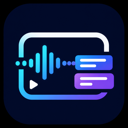

<div align="center">
  
  <h1>视频翻译器</h1>
  <p><a href="README.en.md">English</a> | 简体中文</p>
  <p><strong>完美支持 X 视频/直播与 YouTube 直播的实时中英双语字幕。</strong></p>
  <p>适合观看世界杯等外语直播，边看比赛，边读实时双语字幕。</p>
</div>

## 世界杯与实时直播翻译

从世界杯赛事到发布会、访谈和新闻直播，插件都能提供实时双语字幕。观看 YouTube 世界杯直播或 X 平台赛事视频时，翻译按钮会直接集成到播放器控制栏，无需离开直播页面，即可一边看比赛，一边理解外语解说。

- **YouTube 直播**：自动识别直播状态，支持普通窗口、影院模式和全屏播放。
- **X 视频与直播**：支持帖子内小窗、页面播放器和全屏模式。
- **实时双语字幕**：英文原文与中文翻译同步显示，也可切换为仅中文。
- **低延迟音频传输**：根据网络延迟自动调整音频发送间隔。
- **不遮挡关键画面**：字幕位置、字号和背景透明度均可调节。

## 功能特性

- 完整支持 X（Twitter）视频、X 直播和 YouTube 直播。
- 实时显示英文原文与中文翻译，也可切换为仅中文模式。
- 翻译按钮直接集成到播放器控制栏，并随控制栏显示或隐藏。
- 支持分别调整中英文字号、字幕位置和背景不透明度。
- 针对小窗与全屏播放器自动调整字幕布局，减少对播放按钮的遮挡。
- 支持自动翻译，视频开始播放后可自动启动。
- 内置 API 配置验证，可检查权限、网络、模型和请求结果。
- 根据网络延迟自动选择 `32 / 64 / 128 / 192 / 256 ms` 音频发送间隔。
- 优先使用浏览器原生媒体采集，并提供 Web Audio 音频采集回退。
- API Key 和配置保存在本地浏览器中，不经过项目自建服务器。

## 支持的平台

| 平台 | 支持情况 | 说明 |
| --- | --- | --- |
| X 视频 / 直播 | 完整支持 | 支持帖子播放器、小窗、页面播放器和全屏模式 |
| YouTube 直播 | 完整支持 | 自动识别直播，支持普通窗口、影院模式和全屏模式 |
| YouTube 普通视频 | 暂未支持 | 当前版本只在直播页面启用 |

## 支持的模型服务

| 服务 | 音频处理方式 | 说明 |
| --- | --- | --- |
| **DashScope / Qwen（首选推荐）** | **WebSocket 实时音频流** | **支持千问实时多模态/语音模型，延迟更低，最适合直播同传** |
| Gemini AI Studio | 原生音频 | 使用 Gemini API Key，配置最简单 |
| Google Cloud Vertex AI | 原生音频 | 支持 Express Mode API Key 或 OAuth Access Token |
| MiniMax | 原生音频或兼容接口 | 具体能力取决于所选模型 |
| DeepSeek | STT + 文本模型 | DeepSeek 本身不处理音频，需要先配置语音转写服务 |
| OpenRouter | 原生音频或 STT | 可使用支持音频的模型，也可组合 STT 与文本模型 |
| 自定义接口 | OpenAI 兼容 | 可填写自定义 Base URL、API Key 和模型 ID |

### 首选推荐：DashScope / Qwen

如果希望获得低延迟的 WebSocket 实时流翻译体验，推荐优先使用阿里云 DashScope 的千问实时多模态/语音模型。插件当前已接入：

| 千问模型 | 定位 | 适用场景 |
| --- | --- | --- |
| `qwen3.5-livetranslate-flash-realtime` | 当前首选 | 低延迟实时语音翻译，适合世界杯、访谈和新闻直播 |
| `qwen3-livetranslate-flash-realtime` | 备选实时模型 | WebSocket 双工语音同传 |
| `gummy-realtime-v1` | 原生双语同传 | 直接输出中英双语内容 |

WebSocket 实时流会持续向模型发送播放器音频，因此模型必须能够直接接收并理解音频。仅支持文本输入的模型无法独立完成这条实时链路，需要额外增加 STT 语音转写步骤。千问实时模型原生支持音频流，更适合直播翻译，也是本插件的首选配置。

> DeepSeek 不是多模态音频模型。插件会先通过 STT 服务把声音转换为文字，再使用 DeepSeek 翻译，因此需要同时配置可用的语音转写接口。

## 安装

当前项目需要从源码构建并以“已解压的扩展程序”方式安装。

### 1. 获取源码

```bash
git clone https://github.com/xiaofu2415/EchoX.git
cd EchoX
```

### 2. 安装依赖并构建

建议使用较新的 Node.js LTS 版本。

```bash
npm ci
npm run build
```

构建产物会生成在 `dist/` 目录。

### 3. 加载到 Chrome

1. 打开 `chrome://extensions/`。
2. 开启右上角的“开发者模式”。
3. 点击“加载已解压的扩展程序”。
4. 选择项目中的 `dist/` 目录。
5. 修改代码并重新构建后，在扩展管理页点击“重新加载”。

## 配置

点击浏览器工具栏中的插件图标，再进入设置页面。

1. 选择模型服务。
2. 填写 API Key、模型名称及服务地址。
3. 点击“验证当前配置”。
4. 确认各验证阶段通过后点击“保存设置”。

### Gemini AI Studio

填写 Gemini AI Studio API Key 和支持音频输入的模型名称。默认模型为：

```text
gemini-2.5-flash
```

### Google Cloud Vertex AI

支持两种认证方式：

- **Express API Key**：填写 Vertex AI Express Mode API Key。
- **OAuth Token**：填写 Access Token、Google Cloud Project ID 和 Location。

OAuth Access Token 通常具有有效期，失效后需要重新获取并填写。

### OpenAI 兼容接口

需要填写：

- Base URL
- API Key
- 模型 ID
- 音频处理方式

如果模型不能直接处理音频，请选择“STT + 文本模型”，并继续填写 STT Base URL、API Key、模型和请求格式。

## 使用

1. 打开 X 视频、X 直播或 YouTube 直播页面，例如世界杯赛事直播。
2. 开始播放视频。
3. 将鼠标移入播放器，使播放器控制栏出现。
4. 点击控制栏中的蓝紫色翻译图标。
5. 在弹出的面板中点击“开始”。

播放器面板中还可以设置：

- 自动翻译
- 英文字号
- 中文字幕号
- 字幕条位置
- 字幕背景不透明度
- 恢复默认设置

## 权限与隐私

插件使用以下主要权限：

- `storage`：在浏览器本地保存模型配置和字幕设置。
- `offscreen`：维持实时 WebSocket 音频翻译连接。
- `declarativeNetRequest`：为部分实时接口设置必要的请求头。
- X、Twitter 和 YouTube 页面权限：识别播放器并显示翻译控件。
- 模型 API 域名权限：向用户配置的翻译或 STT 服务发送请求。

音频片段会发送到你选择的第三方模型服务。请在使用前阅读对应服务商的隐私政策和计费规则，不要将 API Key 分享给他人。

## 开发

```bash
# TypeScript 类型检查
npm test

# 构建扩展
npm run build
```

主要目录：

```text
src/background/       API 请求、会话管理和后台消息处理
src/content_script/   播放器适配、音频采集、按钮和字幕渲染
src/offscreen/        实时 WebSocket 连接
src/options/          设置页与弹出窗口
src/shared/           服务商配置与共享设置
icons/                扩展及播放器图标
```

## 已知限制

- YouTube 当前仅支持直播，不会在普通点播视频上显示翻译按钮。
- DRM、跨域媒体策略或浏览器限制可能导致部分视频无法采集音频。
- 翻译延迟和准确度取决于网络、模型服务、音频质量及服务商负载。
- 文本模型不能直接理解视频声音，必须搭配 STT 服务。
- 第三方 API 可能产生费用，请留意账户额度。

## 反馈

发现问题或有功能建议，可以在 [GitHub Issues](https://github.com/xiaofu2415/EchoX/issues) 中提交。

## License

ISC
